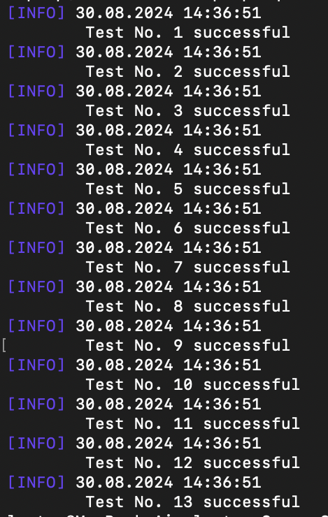
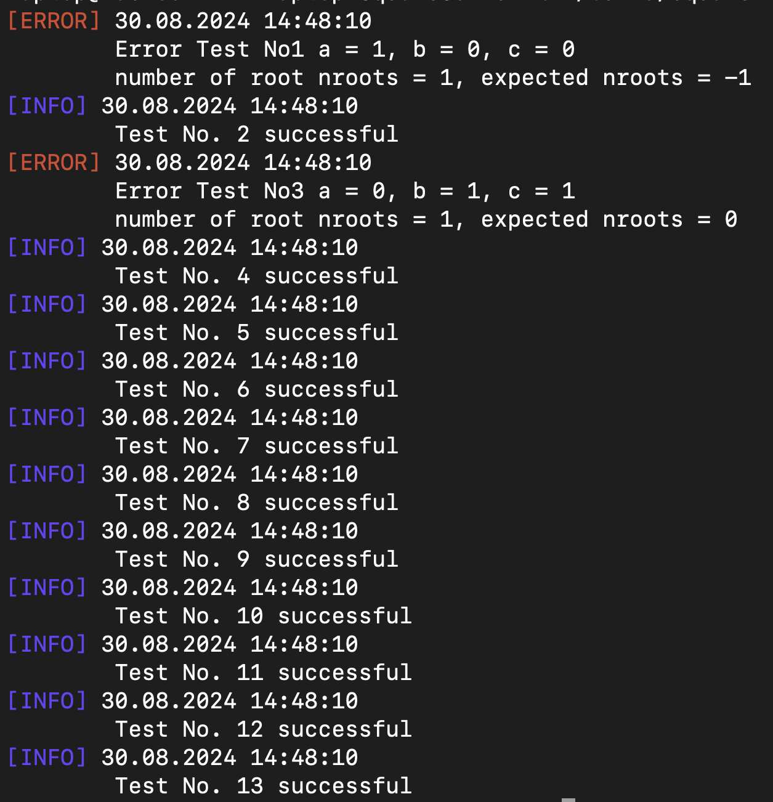

# Quadratic equation solver

## Overview
This repository contains the code and documentation for a program that solves a quadratic equation using three given coefficients.

 

## Build
Run `make` to compile program in default mode.

Run `./build/square` to run program.

> [!NOTE]
> Default mode is `release` mode

---

Run `make release` to compile program in release mode.

### Release mode:
- Unit test are disabled.
- Set compiler optimization level to **o2**.
- Define **NDEBUG** (disables standard-C assertions).

---

Run `make debug` to compile program in debug mode.

### Debug mode:
- Unit test are available.
- Set compiler optimization level to **o0**.
- Add compilation flag **-ggdb3** (produces extra debugging information).

---

Run `make clean` to remove objects and dependencies files (clean build folder).

## Commands
```-t``` | ```--test```- set testing operation mode

```-s``` | ```--solve```- set solving equation operation mode

```-c``` | ```--input_console```- get data from the console

```-i <file name>``` | ```--input_file <file name>```- get data from a file with given name

```-f``` | ```--output_console```- print results to the console

```-o <file name>``` | ```--output_file <file name>```- print results in a file with given name

```-h``` | ```--help```- print help message with all commands' description

